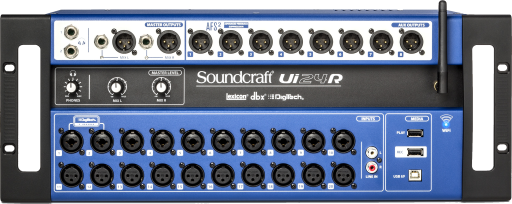

# SoundcraftUiSC



[](https://github.com/HighTechHarmony/SoundcraftUiSC/actions)

> **Note:** This package is not yet available on PyPI. Install from source — see the [Development](#development) section below.

**Soundcraft Ui Series Snapshot Converter** — greatly expanded tools for managing and manipulating show snapshots for Soundcraft Ui series mixers.

> **Note**: this project handles both the **Soundcraft JSON snapshot format** (a.k.a. "_Offline Files_") and the **`.uisnapshot` / `.uishow` files** used on USB show exports.

> **Important**: this has been tested with the firmware version **3.5.8328-ui24**.

---

## Attribution / Upstream

This project is a fork of [dmotte/ui24rsc](https://github.com/dmotte/ui24rsc) by [dmotte](https://github.com/dmotte), whose original work provided the foundation for the JSON↔YAML snapshot conversion engine. As a maintainer with limited resources, dmotte understandably wants to keep the scope of ui24rsc focused on JSON <-> YAML conversion only.

---

## New Direction

This fork significantly expands on the original converter concept, incorporating support for the .uisnapshot format and offering functions that are helpful for managing and manipulating large snapshot libraries. Key additions beyond the original project:

- **Batch conversion between formats** — convert entire folders of offline JSON snapshots to/from the USB `.uisnapshot` tree structure in one command
- **Full USB show tree support** — produce a properly structured `Exports/shows/` hierarchy that the Soundcraft Ui24R loads from USB directly
- **Automatic `.uishow` generation** — each show directory gets a correctly-structured `.uishow` file on export; existing files are preserved to protect your customisations
- **Bidirectional name encoding** — hazardous path characters (e.g. `&`) are percent-encoded on export and decoded on import, matching the device's own convention

---

## Features

### Original features (from dmotte/ui24rsc)

The official Soundcraft Ui24R JSON snapshot export format is very hard to understand and work with. The original project introduced a pipeline of named _actions_ that transform snapshot data to and from human-readable formats:

| Action | Description                                                                       |
| ------ | --------------------------------------------------------------------------------- |
| `diff` | Convert from Soundcraft full JSON to custom diff format (relative to a reference) |
| `full` | Convert from diff format back to full Soundcraft JSON                             |
| `tree` | Convert from dotted-key format to nested tree structure                           |
| `dots` | Convert from nested tree to dotted-key format                                     |
| `sort` | Sort all keys in a snapshot object                                                |

### New features (added in SoundcraftUiSC)

Another frustrating aspect of exporting snapshots on the Ui is that there is a separate format when for when you export/import shows to/from a USB stick (".uisnapshot" format) vs. the separate offline export of current state (JSON format), which downloads or uploads to/from your remote controlling tablet. The below functions are handy for crossing between these formats.

| Action                   | Description                                                                          |
| ------------------------ | ------------------------------------------------------------------------------------ |
| `fromuisnapshot`         | Parse a `.uisnapshot` file into a flat-dots dict                                     |
| `touisnapshot`           | Serialize a flat-dots dict back to `.uisnapshot` format (MD5 appended automatically) |
| `convert-tree json2snap` | batch-convert an offline JSON export folder to a USB `.uisnapshot` tree              |
| `convert-tree snap2json` | batch-convert a USB `.uisnapshot` tree back to offline JSON exports                  |

---

## Installation

This package is **not yet available on PyPI**. Install directly from the repository source — see [Development](#development) below.

---

## Usage

The first parameter of this command is `ACTIONS`, a **comma-separated sequence of operations** which will be used in order to process the input document and produce the output. See [the code](soundcraftuisc/cli.py) for more information on what each action does.

Convert from official Soundcraft JSON format to a human-friendly differential YAML format:

```bash
python3 -msoundcraftuisc diff,tree original.json human-friendly.yml
```

And the opposite:

```bash
python3 -msoundcraftuisc dots,full human-friendly.yml official.json
```

For more details, see `--help`:

```bash
python3 -msoundcraftuisc --help
```

---

## Working with USB show exports (`.uisnapshot`)

The Soundcraft Ui24R can export shows to a USB drive. Each snapshot is stored as a `.uisnapshot` file — a plain-text `key=value` format with an MD5 checksum footer — inside a folder hierarchy like:

```
Exports/
  shows/
    My Show/
      Snapshot A.uisnapshot
      Snapshot B.uisnapshot
      .uishow
```

### Single-file conversion

Convert a `.uisnapshot` file to a flat JSON dots file:

```bash
python3 -msoundcraftuisc fromuisnapshot snapshot.uisnapshot snapshot.json
```

Convert a flat JSON dots file back to a `.uisnapshot` file (MD5 checksum computed and appended automatically):

```bash
python3 -msoundcraftuisc touisnapshot snapshot.json snapshot.uisnapshot
```

Chain actions — convert a `.uisnapshot` directly to human-readable YAML diff:

```bash
python3 -msoundcraftuisc fromuisnapshot,diff,tree snapshot.uisnapshot human-friendly.yml
```

### Batch tree conversion

The `convert-tree` subcommand converts an entire folder of offline JSON snapshots to the USB export tree structure, or vice versa.

**Offline JSON → USB uisnapshot tree:**

```bash
python3 -msoundcraftuisc convert-tree json2snap /path/to/offline/exports /path/to/usb
```

This creates the following structure under `/path/to/usb`:

```
Exports/
  shows/
    S%26S Gigs/           ← show folder name is percent-encoded
      My Snapshot.uisnapshot
      .uishow             ← generated automatically (see below)
```

Any character that is hazardous in a file path (e.g. `&`) is percent-encoded in the output folder/file names. Spaces are kept as-is to match the device's own naming convention.

**USB uisnapshot tree → offline JSON:**

```bash
python3 -msoundcraftuisc convert-tree snap2json /path/to/usb /path/to/offline/exports
```

Percent-encoded folder and file names are decoded back to their original form in the output.

### `.uishow` files

Each show directory on the USB drive contains a `.uishow` file that stores per-show metadata (channel isolation groups, VCA groups, safe/mgmask flags per channel).

When running `convert-tree json2snap`, a default `.uishow` file is generated automatically for each show. It sets all `safe` and `mgmask` values to `0` and leaves iso/VG group fields empty.

> **Note**: if a `.uishow` file already exists in the destination, it will **not** be overwritten. This lets you customise the file once and keep your changes across repeated conversions.

---

## Development

Create a Python virtual environment with the package in editable mode:

```bash
python3 -mvenv venv
venv/bin/python3 -mpip install -e .
```

Run the tests:

```bash
venv/bin/python3 -mpip install pytest ruff
venv/bin/python3 -mpytest test
```

Run linting:

```bash
venv/bin/ruff check soundcraftuisc test
```

---

## Other useful stuff

The [`default-init.yml`](soundcraftuisc/default-init.yml) file was built by exporting the `* Init *` snapshot (from the `Default` show of the Soundcraft Ui24R), which should contain the mixer factory default settings, and then running:

```bash
python3 -msoundcraftuisc tree,sort default-init.json default-init.yml
```

To verify the two files are equivalent (requires [`jq`](https://stedolan.github.io/jq/)):

```bash
diff <(jq --sort-keys < default-init.json) <(python3 -msoundcraftuisc dots default-init.yml | jq --sort-keys)
```

To see differences between two snapshot files in different formats:

```bash
diff <(jq --sort-keys < snapshot01.json) <(python3 -msoundcraftuisc dots,full snapshot01.yml | jq --sort-keys)
```

---

## Todo / Roadmap

- Get PyPI packaging working.
- Library manager (browse, archive, store and retrieve selected snapshots to/from a database and direct at a USB stick for machine transfer)
- Support and test w/ other mixers in the Ui series (currenty only Ui24R)

---

## Contributions

I welcome contributions with bugfixes and enhancements that are pertinent to the stated direction above. Since I maintain more projects than I can currently handle, only high-quality code changes are appreciated and will be considered for PR.
